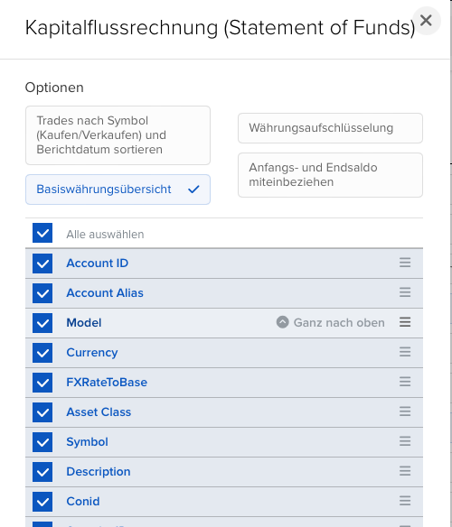

# MoneyMoney IBKR Extension

Unofficial IBKR extension for MoneyMoney.

## Release Notes

*** Warning - currently not signed by MoneyMoney. Waiting for approval. So you have to allow unsigned extensions in the settings. ***

### 0.5

- FIX: use current IBKR Flex Web Service endpoint and retry temporary Flex statement errors ([#21](https://github.com/krambox/moneymoney-ibkr/pull/21))

### 0.4

- FIX: currency conversion ([#8](https://github.com/krambox/moneymoney-ibkr/pull/8))

### 0.3

- Update IB endpoint ([#18](https://github.com/krambox/moneymoney-ibkr/pull/18))

### 0.2

Attention: You must extend your Flex query Statement Of Funds

- Support Statements
- Quote XML Chars
- Ignore 'ADJ' activities in Statements
- Fix (some) foreign currencies issues

### 0.1

- Initial Version

## Setup

1. Download the extension from [moneymoney.app/extensions](https://moneymoney.app/extensions/) ([direct link](https://moneymoney.app/extensions/ibkr.lua)).
2. Move `ibkr.lua` to your MoneyMoney Extensions folder.
3. Set up an IBKR Flex Query and activate the Flex Web Service.
    1. Flex Query Sections
      
    2. Flex Query NAC
      
    3. Flex Query Open Positions
      
    4. Flex Query Statement Of Funds
      
    5. Flex Query Configuration
      

4. Use the Flex Query ID as the username and the Flex Web Service token as the password.
5. Add a new account with the type `IBKR`.
6. The extension provides two EUR accounts: one `AccountTypePortfolio` account for open positions and one `AccountTypeOther` account for the cash balance.
